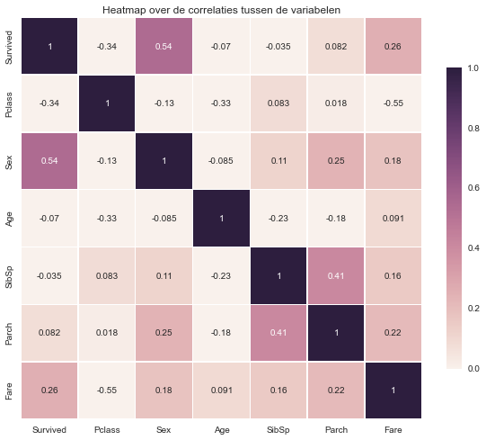
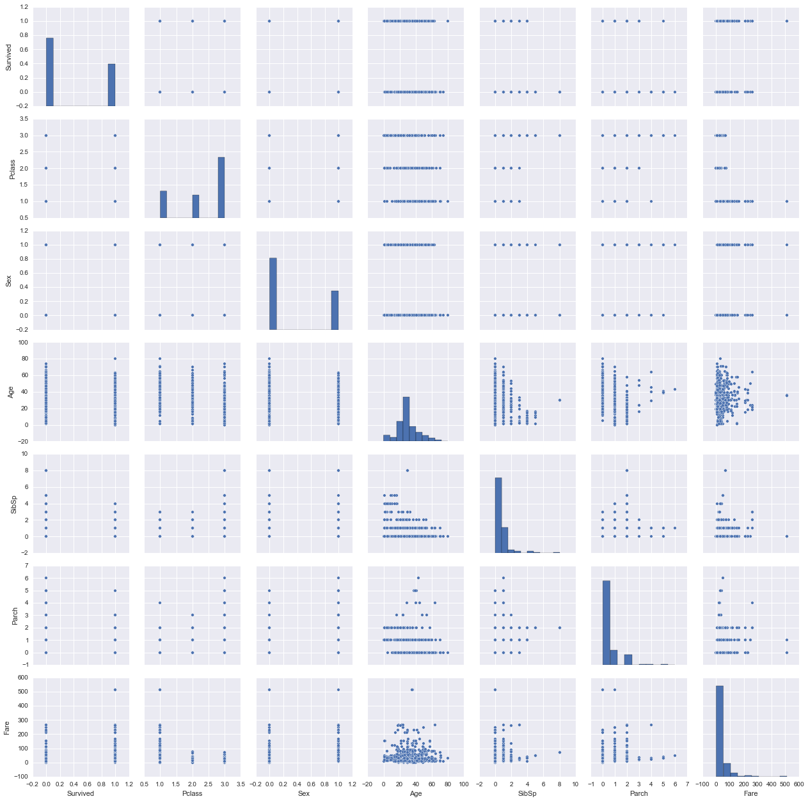

    %matplotlib inline
    # Scientific computing
    import numpy as np
    
    # Data frames (R-style)
    import pandas as pd
    
    # Visualisation
    import matplotlib.pyplot as plt
    import seaborn as sns
    
    # Machine learning packages
    from sklearn import tree
    from sklearn.tree import export_graphviz
    from sklearn.metrics import confusion_matrix, f1_score, roc_auc_score
    from sklearn.ensemble import RandomForestClassifier

    # Read data
    train_data = pd.read_csv('./train.csv')
    test_data = pd.read_csv('./test.csv')
    test_y = pd.read_csv('./gender_submission.csv').Survived
    
    train_data.head(10)

<table border="1" class="dataframe">
  <thead>
    <tr style="text-align: right;">
      <th></th>
      <th>PassengerId</th>
      <th>Survived</th>
      <th>Pclass</th>
      <th>Name</th>
      <th>Sex</th>
      <th>Age</th>
      <th>SibSp</th>
      <th>Parch</th>
      <th>Ticket</th>
      <th>Fare</th>
      <th>Cabin</th>
      <th>Embarked</th>
    </tr>
  </thead>
  <tbody>
    <tr>
      <th>0</th>
      <td>1</td>
      <td>0</td>
      <td>3</td>
      <td>Braund, Mr. Owen Harris</td>
      <td>male</td>
      <td>22</td>
      <td>1</td>
      <td>0</td>
      <td>A/5 21171</td>
      <td>7.2500</td>
      <td>NaN</td>
      <td>S</td>
    </tr>
    <tr>
      <th>1</th>
      <td>2</td>
      <td>1</td>
      <td>1</td>
      <td>Cumings, Mrs. John Bradley (Florence Briggs Th...</td>
      <td>female</td>
      <td>38</td>
      <td>1</td>
      <td>0</td>
      <td>PC 17599</td>
      <td>71.2833</td>
      <td>C85</td>
      <td>C</td>
    </tr>
    <tr>
      <th>2</th>
      <td>3</td>
      <td>1</td>
      <td>3</td>
      <td>Heikkinen, Miss. Laina</td>
      <td>female</td>
      <td>26</td>
      <td>0</td>
      <td>0</td>
      <td>STON/O2. 3101282</td>
      <td>7.9250</td>
      <td>NaN</td>
      <td>S</td>
    </tr>
    <tr>
      <th>3</th>
      <td>4</td>
      <td>1</td>
      <td>1</td>
      <td>Futrelle, Mrs. Jacques Heath (Lily May Peel)</td>
      <td>female</td>
      <td>35</td>
      <td>1</td>
      <td>0</td>
      <td>113803</td>
      <td>53.1000</td>
      <td>C123</td>
      <td>S</td>
    </tr>
    <tr>
      <th>4</th>
      <td>5</td>
      <td>0</td>
      <td>3</td>
      <td>Allen, Mr. William Henry</td>
      <td>male</td>
      <td>35</td>
      <td>0</td>
      <td>0</td>
      <td>373450</td>
      <td>8.0500</td>
      <td>NaN</td>
      <td>S</td>
    </tr>
    <tr>
      <th>5</th>
      <td>6</td>
      <td>0</td>
      <td>3</td>
      <td>Moran, Mr. James</td>
      <td>male</td>
      <td>NaN</td>
      <td>0</td>
      <td>0</td>
      <td>330877</td>
      <td>8.4583</td>
      <td>NaN</td>
      <td>Q</td>
    </tr>
    <tr>
      <th>6</th>
      <td>7</td>
      <td>0</td>
      <td>1</td>
      <td>McCarthy, Mr. Timothy J</td>
      <td>male</td>
      <td>54</td>
      <td>0</td>
      <td>0</td>
      <td>17463</td>
      <td>51.8625</td>
      <td>E46</td>
      <td>S</td>
    </tr>
    <tr>
      <th>7</th>
      <td>8</td>
      <td>0</td>
      <td>3</td>
      <td>Palsson, Master. Gosta Leonard</td>
      <td>male</td>
      <td>2</td>
      <td>3</td>
      <td>1</td>
      <td>349909</td>
      <td>21.0750</td>
      <td>NaN</td>
      <td>S</td>
    </tr>
    <tr>
      <th>8</th>
      <td>9</td>
      <td>1</td>
      <td>3</td>
      <td>Johnson, Mrs. Oscar W (Elisabeth Vilhelmina Berg)</td>
      <td>female</td>
      <td>27</td>
      <td>0</td>
      <td>2</td>
      <td>347742</td>
      <td>11.1333</td>
      <td>NaN</td>
      <td>S</td>
    </tr>
    <tr>
      <th>9</th>
      <td>10</td>
      <td>1</td>
      <td>2</td>
      <td>Nasser, Mrs. Nicholas (Adele Achem)</td>
      <td>female</td>
      <td>14</td>
      <td>1</td>
      <td>0</td>
      <td>237736</td>
      <td>30.0708</td>
      <td>NaN</td>
      <td>C</td>
    </tr>
  </tbody>
</table>

    train_data.info()
    print("--------------")
    test_data.info()

    <class 'pandas.core.frame.DataFrame'>
    Int64Index: 891 entries, 0 to 890
    Data columns (total 12 columns):
    PassengerId    891 non-null int64
    Survived       891 non-null int64
    Pclass         891 non-null int64
    Name           891 non-null object
    Sex            891 non-null object
    Age            714 non-null float64
    SibSp          891 non-null int64
    Parch          891 non-null int64
    Ticket         891 non-null object
    Fare           891 non-null float64
    Cabin          204 non-null object
    Embarked       889 non-null object
    dtypes: float64(2), int64(5), object(5)
    memory usage: 90.5+ KB
    --------------
    <class 'pandas.core.frame.DataFrame'>
    Int64Index: 418 entries, 0 to 417
    Data columns (total 11 columns):
    PassengerId    418 non-null int64
    Pclass         418 non-null int64
    Name           418 non-null object
    Sex            418 non-null object
    Age            332 non-null float64
    SibSp          418 non-null int64
    Parch          418 non-null int64
    Ticket         418 non-null object
    Fare           417 non-null float64
    Cabin          91 non-null object
    Embarked       418 non-null object
    dtypes: float64(2), int64(4), object(5)
    memory usage: 39.2+ KB
    

We hebben dus 891 entries. De meeste data lijkt compleet, maar bij leeftijd missen er een aantal waardes. Voor test is dit hetzelfde, maar mist er ook een fare waarde.

    grouped = train_data.groupby('Survived')
    grouped.count()

<table border="1" class="dataframe">
  <thead>
    <tr style="text-align: right;">
      <th></th>
      <th>PassengerId</th>
      <th>Pclass</th>
      <th>Name</th>
      <th>Sex</th>
      <th>Age</th>
      <th>SibSp</th>
      <th>Parch</th>
      <th>Ticket</th>
      <th>Fare</th>
      <th>Cabin</th>
      <th>Embarked</th>
    </tr>
    <tr>
      <th>Survived</th>
      <th></th>
      <th></th>
      <th></th>
      <th></th>
      <th></th>
      <th></th>
      <th></th>
      <th></th>
      <th></th>
      <th></th>
      <th></th>
    </tr>
  </thead>
  <tbody>
    <tr>
      <th>0</th>
      <td>549</td>
      <td>549</td>
      <td>549</td>
      <td>549</td>
      <td>424</td>
      <td>549</td>
      <td>549</td>
      <td>549</td>
      <td>549</td>
      <td>68</td>
      <td>549</td>
    </tr>
    <tr>
      <th>1</th>
      <td>342</td>
      <td>342</td>
      <td>342</td>
      <td>342</td>
      <td>290</td>
      <td>342</td>
      <td>342</td>
      <td>342</td>
      <td>342</td>
      <td>136</td>
      <td>340</td>
    </tr>
  </tbody>
</table>

Als we de data groeperen op onze doel-variabele, zien we dat de klassen redelijk gebalanceerd zijn.

We hebben dus redelijk gebalanceerde aantallen over de doel-variabele en de data is ook vrij goed (weinig missende getallen).

Wel hebben we een aantal categoriën die minder zeggen (naam, id, kaartnummer, waar ze ingestapt zijn). Deze variabelen kunnen we uit de set gooien.

Daarna moeten we de NAN's in de age kolom nog aanpakken. 

We gaan er hier even van uit dat dit hetzelfde is voor de test data.

    train_data.drop(['PassengerId','Name','Ticket','Cabin','Embarked'], axis=1, inplace=True)
    train_data['Age'].fillna(train_data['Age'].mean(), inplace=True)
    train_data.Age = train_data.Age.round(decimals=0)
    train_data.head(10)

<table border="1" class="dataframe">
  <thead>
    <tr style="text-align: right;">
      <th></th>
      <th>Survived</th>
      <th>Pclass</th>
      <th>Sex</th>
      <th>Age</th>
      <th>SibSp</th>
      <th>Parch</th>
      <th>Fare</th>
    </tr>
  </thead>
  <tbody>
    <tr>
      <th>0</th>
      <td>0</td>
      <td>3</td>
      <td>male</td>
      <td>22</td>
      <td>1</td>
      <td>0</td>
      <td>7.2500</td>
    </tr>
    <tr>
      <th>1</th>
      <td>1</td>
      <td>1</td>
      <td>female</td>
      <td>38</td>
      <td>1</td>
      <td>0</td>
      <td>71.2833</td>
    </tr>
    <tr>
      <th>2</th>
      <td>1</td>
      <td>3</td>
      <td>female</td>
      <td>26</td>
      <td>0</td>
      <td>0</td>
      <td>7.9250</td>
    </tr>
    <tr>
      <th>3</th>
      <td>1</td>
      <td>1</td>
      <td>female</td>
      <td>35</td>
      <td>1</td>
      <td>0</td>
      <td>53.1000</td>
    </tr>
    <tr>
      <th>4</th>
      <td>0</td>
      <td>3</td>
      <td>male</td>
      <td>35</td>
      <td>0</td>
      <td>0</td>
      <td>8.0500</td>
    </tr>
    <tr>
      <th>5</th>
      <td>0</td>
      <td>3</td>
      <td>male</td>
      <td>30</td>
      <td>0</td>
      <td>0</td>
      <td>8.4583</td>
    </tr>
    <tr>
      <th>6</th>
      <td>0</td>
      <td>1</td>
      <td>male</td>
      <td>54</td>
      <td>0</td>
      <td>0</td>
      <td>51.8625</td>
    </tr>
    <tr>
      <th>7</th>
      <td>0</td>
      <td>3</td>
      <td>male</td>
      <td>2</td>
      <td>3</td>
      <td>1</td>
      <td>21.0750</td>
    </tr>
    <tr>
      <th>8</th>
      <td>1</td>
      <td>3</td>
      <td>female</td>
      <td>27</td>
      <td>0</td>
      <td>2</td>
      <td>11.1333</td>
    </tr>
    <tr>
      <th>9</th>
      <td>1</td>
      <td>2</td>
      <td>female</td>
      <td>14</td>
      <td>1</td>
      <td>0</td>
      <td>30.0708</td>
    </tr>
  </tbody>
</table>

    test_data.drop(['PassengerId','Name','Ticket','Cabin','Embarked'], axis=1, inplace=True)
    test_data['Age'].fillna(test_data['Age'].mean(), inplace=True)
    test_data.Age = test_data.Age.round(decimals=0)
    test_data['Fare'].fillna(test_data['Fare'].median(), inplace=True)
    test_data.info()

    <class 'pandas.core.frame.DataFrame'>
    Int64Index: 418 entries, 0 to 417
    Data columns (total 6 columns):
    Pclass    418 non-null int64
    Sex       418 non-null object
    Age       418 non-null float64
    SibSp     418 non-null int64
    Parch     418 non-null int64
    Fare      418 non-null float64
    dtypes: float64(2), int64(3), object(1)
    memory usage: 22.9+ KB
    

Als laatste voorbereiding maken we van een aantal variablen categorische variabelen.

    #train_data.Pclass = train_data.Pclass.astype('category')
    #train_data.Sex = train_data.Sex.astype('category')
    train_data['Sex'] = np.where(train_data['Sex'] == 'female', 1, 0)
    
    #test_data.Pclass = test_data.Pclass.astype('category')
    #test_data.Sex = test_data.Sex.astype('category')
    test_data['Sex'] = np.where(test_data['Sex'] == 'female', 1, 0)
    test_data.head(10)

<table border="1" class="dataframe">
  <thead>
    <tr style="text-align: right;">
      <th></th>
      <th>Pclass</th>
      <th>Sex</th>
      <th>Age</th>
      <th>SibSp</th>
      <th>Parch</th>
      <th>Fare</th>
    </tr>
  </thead>
  <tbody>
    <tr>
      <th>0</th>
      <td>3</td>
      <td>0</td>
      <td>34</td>
      <td>0</td>
      <td>0</td>
      <td>7.8292</td>
    </tr>
    <tr>
      <th>1</th>
      <td>3</td>
      <td>1</td>
      <td>47</td>
      <td>1</td>
      <td>0</td>
      <td>7.0000</td>
    </tr>
    <tr>
      <th>2</th>
      <td>2</td>
      <td>0</td>
      <td>62</td>
      <td>0</td>
      <td>0</td>
      <td>9.6875</td>
    </tr>
    <tr>
      <th>3</th>
      <td>3</td>
      <td>0</td>
      <td>27</td>
      <td>0</td>
      <td>0</td>
      <td>8.6625</td>
    </tr>
    <tr>
      <th>4</th>
      <td>3</td>
      <td>1</td>
      <td>22</td>
      <td>1</td>
      <td>1</td>
      <td>12.2875</td>
    </tr>
    <tr>
      <th>5</th>
      <td>3</td>
      <td>0</td>
      <td>14</td>
      <td>0</td>
      <td>0</td>
      <td>9.2250</td>
    </tr>
    <tr>
      <th>6</th>
      <td>3</td>
      <td>1</td>
      <td>30</td>
      <td>0</td>
      <td>0</td>
      <td>7.6292</td>
    </tr>
    <tr>
      <th>7</th>
      <td>2</td>
      <td>0</td>
      <td>26</td>
      <td>1</td>
      <td>1</td>
      <td>29.0000</td>
    </tr>
    <tr>
      <th>8</th>
      <td>3</td>
      <td>1</td>
      <td>18</td>
      <td>0</td>
      <td>0</td>
      <td>7.2292</td>
    </tr>
    <tr>
      <th>9</th>
      <td>3</td>
      <td>0</td>
      <td>21</td>
      <td>2</td>
      <td>0</td>
      <td>24.1500</td>
    </tr>
  </tbody>
</table>

Nu kunnen we gaan kijken naar de data

    correlations = train_data.corr()
    print(correlations['Survived'])
    
    plt.figure(figsize=(10,10))
    sns.heatmap(correlations,linewidths=0.25, square=True, cbar_kws={'shrink' : .6}, annot=True, vmin=0, vmax=1)
    plt.title("Heatmap over de correlaties tussen de variabelen")

    Survived    1.000000
    Pclass     -0.338481
    Sex         0.543351
    Age        -0.070324
    SibSp      -0.035322
    Parch       0.081629
    Fare        0.257307
    Name: Survived, dtype: float64
    

    <matplotlib.text.Text at 0x938f550>

Het lijkt er op dat er niet veel variabelen zijn die sterk met elkaar gecorreleerd zijn. Hier hoeven we dus niet veel voorwerk te doen.

Laten we als laatste eens kijken naar hoe de variabelen onderling verdeeld zijn. 

    sns.pairplot(train_data)

    <seaborn.axisgrid.PairGrid at 0x931aac8>

    # Train the model 
    train_x = train_data.drop('Survived', axis=1, inplace=False)
    train_y = train_data.Survived
    
    classifier = tree.DecisionTreeClassifier()
    classifier.fit(train_x, train_y)

    DecisionTreeClassifier(class_weight=None, criterion='gini', max_depth=None,
                max_features=None, max_leaf_nodes=None, min_samples_leaf=1,
                min_samples_split=2, min_weight_fraction_leaf=0.0,
                random_state=None, splitter='best')

    # Check score on training set
    cm_train = confusion_matrix(train_y, classifier.predict(train_x))
    auc_train = roc_auc_score(train_y, classifier.predict(train_x))
    f1_train = f1_score(train_y, classifier.predict(train_x))
    print(cm_train)
    print('------------------------------')
    print('AUC      : {}'.format(auc_train))
    print('F1 Score : {}'.format(f1_train))

    [[546   3]
     [ 16 326]]
    ------------------------------
    AUC      : 0.9738759466973445
    F1 Score : 0.9716840536512668
    

    # Create predictions on the test set
    predictions = classifier.predict(test_data)

    # Score on the test outcomes
    cm_test = confusion_matrix(test_y, predictions)
    f1_test = f1_score(test_y, predictions)
    auc_test = roc_auc_score(test_y, predictions)
    print(cm_test)
    print('------------------------------')
    print('AUC      : {}'.format(auc_test))
    print('F1 Score : {}'.format(f1_test))

    [[225  41]
     [ 35 117]]
    ------------------------------
    AUC      : 0.8078007518796992
    F1 Score : 0.7548387096774193
    

    # Save decision tree to file, reload it and show in a plot
    #with open("dt.dot", 'w') as f:
    #    export_graphviz(classifier, out_file=f,
    #                    feature_names=list(train_x))
    #
    #    pydot.graph_from_dot_data(dotfile.getvalue()).write_png(file_path)
    #    i = misc.imread(file_path)
    #    plt.imshow(i)

There seems to be a lot of overfitting. Perhaps we can tweak the model to have some more constraints.

    # Look at our current tree
    classifier.get_params

    <bound method DecisionTreeClassifier.get_params of DecisionTreeClassifier(class_weight=None, criterion='gini', max_depth=None,
                max_features=None, max_leaf_nodes=None, min_samples_leaf=1,
                min_samples_split=2, min_weight_fraction_leaf=0.0,
                random_state=None, splitter='best')>

    c2 = tree.DecisionTreeClassifier(max_depth = 15, max_leaf_nodes=10)
    c2.fit(train_x, train_y)
    
    f1_score(train_y, c2.predict(train_x))

    0.76609105180533754

We not have a highly constrained decision tree. A much lower score on the train set means we're not fitting to all our training examples anymore. 

Lets see if this helps our test predictions any

    pred = c2.predict(test_data)
    print(confusion_matrix(test_y, pred))
    print("------------------------------")
    print("AUC Score = {}".format(roc_auc_score(test_y, pred)))
    print("F1 Score  = {}".format(f1_score(test_y, pred)))

    [[260   6]
     [ 12 140]]
    -----------------------------
    AUC Score = 0.9492481203007519
    F1 Score  = 0.9395973154362416
    

We get a much better score with our constrained tree. Overfitting indeed was the problem.

Finally lets try a Random Forest to see if a whole set of (constrained) decision trees does better then a single tree.

    forest = RandomForestClassifier(n_estimators=100, max_leaf_nodes=10)
    forest.fit(train_x, train_y)
    y_pred = forest.predict(test_data)
    print("Accuracy score = {}".format(forest.score(test_data, test_y)))
    print("F1 score       = {}".format(f1_score(test_y, y_pred)))
    print("AUC score      = {}".format(roc_auc_score(test_y,y_pred)))
    print("---------")
    print(confusion_matrix(test_y, y_pred))

    Accuracy score = 0.930622009569378
    F1 score       = 0.9010238907849829
    AUC score      = 0.9172932330827068
    ---------
    [[257   9]
     [ 20 132]]
    
